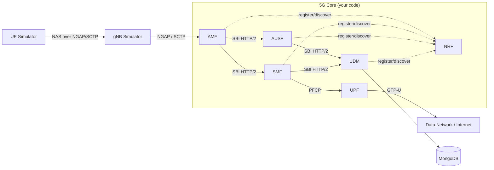

<p align="center">
  
</p>

# Mikoto — Cloud-Native 5G Core Network Prototype

> A from-scratch, **cloud-native 5G Core Network** prototype built as a set of
> containerised micro-services ("network functions"), following the 3GPP
> Release 15+ **Service-Based Architecture (SBA)**.

Mikoto implements the smallest coherent set of network functions that can carry
**real user traffic** for a simulated phone — exercising every important layer of a
mobile core: radio-facing signalling, internal service APIs (SBI), the user-plane
data path, deployment, and observability.

It is an **educational, demonstrable prototype** — not a standards-compliant
product. The engineering value lives in the NF business logic, state machines, SBI
services, service registration/discovery, call-flow orchestration, and deployment,
while low-level protocol codecs (NGAP/NAS/PFCP) and the GTP-U data path are reused
from the open-source 5G ecosystem.

---

## Table of contents

- [Goal](#goal)
- [The MVP at a glance](#the-mvp-at-a-glance)
- [Network functions](#network-functions)
- [Architecture](#architecture)
- [Technology stack](#technology-stack)
- [Repository layout](#repository-layout)
- [Getting started](#getting-started)
- [Development roadmap](#development-roadmap)
- [Definition of done](#definition-of-done)
- [Documentation](#documentation)
- [License & third-party code](#license--third-party-code)

---

## Goal

Implement the full flow end-to-end:

> **UE registration → 5G-AKA authentication → PDU session → user-plane data**,
> deployed as containerised micro-services with full observability.

If a packet leaves the simulated UE, traverses your **AMF / SMF / UPF**, reaches the
internet, and a reply comes back — you have built a working 5G Core.

---

## The MVP at a glance



**Six functions** make up the MVP: **NRF, AMF, SMF, UPF, AUSF, UDM.**
Everything else (PCF, NSSF, NEF, CHF, BSF, N3IWF…) is an explicit stretch goal.

---

## Network functions

| NF       | Responsibility                                                                 |
|----------|--------------------------------------------------------------------------------|
| **NRF**  | Registry — every NF registers here; others discover each other through it      |
| **AMF**  | Talks to the radio (gNB) over SCTP/NGAP; orchestrates registration & sessions  |
| **AUSF** | Runs the authentication algorithm (5G-AKA)                                      |
| **UDM**  | Owns subscriber identity & keys; derives authentication vectors                |
| **SMF**  | Manages PDU sessions; controls the UPF over PFCP; allocates the UE IP           |
| **UPF**  | Forwards user packets between the UE tunnel and the internet (GTP-U)            |

Per-NF specifications live in [`docs/06-network-functions/`](docs/06-network-functions/).

---

## Architecture

Every NF follows the **same layered layout** so the codebase stays uniform:

```
nf-name/
├── cmd/main.go            # entrypoint: load config, start servers
├── internal/
│   ├── context/           # in-memory state (subscribers, sessions, peers)
│   ├── sbi/               # HTTP/2 server: routes + handlers (the NF's API)
│   ├── processor/         # business logic / state machines
│   ├── consumer/          # SBI client calls this NF makes to other NFs
│   └── logger/            # structured logging
├── pkg/
│   ├── factory/           # config struct + loader (YAML)
│   └── service/           # wiring: init context, register to NRF, run
├── config/nf-name.yaml
├── Dockerfile
└── go.mod
```

**Cross-cutting conventions (all NFs):**

- `sbi/` = server side (APIs this NF exposes); `consumer/` = client side (calls it makes).
- Config is externalised in YAML (`-c` flag), never hard-coded.
- Structured logging including `nf`, `supi`, and a `trace_id`.
- Startup order: load config → init context → start SBI server → **register with NRF**.
- Always resolve peers via NRF — never hard-code peer URLs.
- Each NF exposes `GET /healthz` and `GET /metrics` (Prometheus).

See [`docs/02-system-architecture.md`](docs/02-system-architecture.md) for full detail.

---

## Technology stack

| Area                | Choice                                                              |
|---------------------|--------------------------------------------------------------------|
| Language            | **Go 1.26+** (goroutines, static binaries, HTTP/2, 5G ecosystem)    |
| Inter-NF transport  | HTTP/2 + JSON (3GPP SBI)                                            |
| Protocol codecs     | Reused NGAP / NAS / PFCP / SCTP libraries (e.g. `github.com/free5gc/...`) |
| Crypto              | MILENAGE / KDF (5G-AKA auth vectors, key derivation)               |
| Data path           | **`gtp5g`** Linux kernel module (GTP-U with PDR/FAR rules)          |
| RAN/UE simulator    | **UERANSIM** (alt: PacketRusher for load testing)                  |
| Database            | **MongoDB** (subscriber profiles, keys, session records)           |
| Containers          | Docker + Docker Compose (stretch: Kubernetes + Helm)               |
| Observability       | Prometheus + Grafana (optional: OpenTelemetry + Jaeger)            |
| Packet analysis     | Wireshark / tcpdump                                                |

Full rationale: [`docs/03-technology-stack.md`](docs/03-technology-stack.md).

**Minimum host:** Ubuntu 22.04 (VM or bare metal), 4 cores, 8 GB RAM, 20 GB disk,
a kernel that allows loading custom modules (`gtp5g`).

---

## Repository layout

```
Mikoto/
├── docs/                  ← engineering roadmap & specs (start here)
│   ├── 00-overview.md
│   ├── 01-5g-architecture-primer.md
│   ├── 02-system-architecture.md
│   ├── 03-technology-stack.md
│   ├── 04-environment-setup.md
│   ├── 05-roadmap.md
│   ├── 06-network-functions/   ← one spec per NF (NRF, AMF, SMF, UPF, AUSF, UDM)
│   ├── 07-call-flows.md
│   ├── 08-sbi-api-design.md
│   ├── 09-data-model.md
│   ├── 10-testing-validation.md
│   ├── 11-deployment-observability.md
│   ├── 12-glossary.md
│   └── 13-resources.md
├── assets/                ← diagrams & images
├── nrf/  amf/  smf/  upf/  ausf/  udm/   ← each NF: Go module + Dockerfile
├── common/                ← shared SBI client, models, config, logging
├── deploy/                ← docker-compose.yml, kubernetes/, observability/
├── config/                ← per-NF YAML config
├── scripts/               ← build, run, test helpers
├── README.md
└── Makefile
```

> The NF source directories above are the target layout — implement them per the
> roadmap. The current repository contains the `docs/` and `assets/` folders.

---

## Getting started

You are developing on **Windows 11** — but the UPF needs to load a Linux kernel
module, so the reliable path is an **Ubuntu 22.04 VM** (or WSL2 for the control plane).

```bash
# 1. Base packages (inside the Ubuntu VM)
sudo apt update && sudo apt install -y git make gcc cmake build-essential \
    libsctp-dev lksctp-tools iproute2 wget curl net-tools tcpdump

# 2. Go 1.26+
wget https://go.dev/dl/go1.26.0.linux-amd64.tar.gz
sudo rm -rf /usr/local/go && sudo tar -C /usr/local -xzf go1.26.0.linux-amd64.tar.gz
echo 'export PATH=$PATH:/usr/local/go/bin:$HOME/go/bin' >> ~/.bashrc && source ~/.bashrc

# 3. gtp5g kernel module (the UPF data path)
sudo apt install -y linux-headers-$(uname -r)
git clone https://github.com/free5gc/gtp5g.git && cd gtp5g && make && sudo make install
sudo modprobe gtp5g && lsmod | grep gtp5g

# 4. MongoDB + UERANSIM — see docs/04-environment-setup.md

# 5. Enable IP forwarding so user data can reach the internet
sudo sysctl -w net.ipv4.ip_forward=1
sudo iptables -t nat -A POSTROUTING -o eth0 -j MASQUERADE
```

Once Dockerfiles + compose exist, the control plane runs with:

```bash
docker compose up -d nrf udm ausf amf smf mongodb
docker compose logs -f amf
```

Full step-by-step (including the environment checklist and troubleshooting):
[`docs/04-environment-setup.md`](docs/04-environment-setup.md).

---

## Development roadmap

Built as **vertical slices** — the thinnest path that gets a packet a little further
each milestone. Designed for a 4–6 month (≈ 24-week) internship.

| Milestone | Focus                              | Demo / "done"                                          |
|-----------|------------------------------------|--------------------------------------------------------|
| **M0**    | Environment & NF skeleton          | `curl localhost:8000/healthz` → 200                    |
| **M1**    | NRF & service registration         | `GET /nnrf-nfm/v1/nf-instances` lists live NFs         |
| **M2**    | AMF + NGAP/NAS handshake           | Wireshark shows NG Setup + Initial UE Message          |
| **M3**    | Authentication (AUSF + UDM)        | UE reaches "Registered"; AMF prints `5G-AKA success`   |
| **M4**    | PDU session (SMF)                  | UE gets an IP; `uesimtun0` interface created           |
| **M5**    | User plane (UPF)                   | `ping -I uesimtun0 8.8.8.8` succeeds ← headline result |
| **M6**    | Observability                      | Live KPIs move on a Grafana dashboard                  |
| **M7**    | Hardening, packaging & stretch     | `docker compose up` brings up the whole core + CI      |

Full plan, Gantt, and effort weighting: [`docs/05-roadmap.md`](docs/05-roadmap.md).

---

## Definition of done

The prototype is complete when a simulated UE can:

1. **Register** — UE attaches; AMF accepts; subscriber state recorded.
2. **Authenticate** — 5G-AKA completes (UDM → AUSF → AMF → UE).
3. **Establish a PDU session** — SMF programs the UPF; UE gets an IP.
4. **Send data** — `ping 8.8.8.8` over the UE tunnel succeeds through your UPF.
5. **Be observed** — Grafana shows live registration / session / throughput KPIs.

---

## Documentation

Read the docs in order — each builds on the previous one. Start at
[`docs/README.md`](docs/README.md).

| #  | Document                                                                  | What it gives you                                  |
|----|---------------------------------------------------------------------------|----------------------------------------------------|
| 00 | [Overview & Vision](docs/00-overview.md)                                  | Scope, MVP definition, success criteria            |
| 01 | [5G Architecture Primer](docs/01-5g-architecture-primer.md)               | Concepts to know before coding                     |
| 02 | [System Architecture](docs/02-system-architecture.md)                     | Components and how they connect                     |
| 03 | [Technology Stack](docs/03-technology-stack.md)                           | Languages, libraries, tools, rationale             |
| 04 | [Environment Setup](docs/04-environment-setup.md)                         | A working Linux dev/lab environment                |
| 05 | [Development Roadmap](docs/05-roadmap.md)                                  | Phased plan, milestones, timeline                  |
| 06 | [Network Function Specs](docs/06-network-functions/)                      | One spec per NF                                     |
| 07 | [Call Flows](docs/07-call-flows.md)                                       | Signalling sequences to implement                  |
| 08 | [SBI API Design](docs/08-sbi-api-design.md)                               | REST API contracts between functions               |
| 09 | [Data Model](docs/09-data-model.md)                                       | Subscriber, session, NF-profile schemas            |
| 10 | [Testing & Validation](docs/10-testing-validation.md)                     | How to prove each milestone works                  |
| 11 | [Deployment & Observability](docs/11-deployment-observability.md)         | Docker, Kubernetes, Prometheus, Grafana            |
| 12 | [Glossary](docs/12-glossary.md)                                           | Every acronym, defined                             |
| 13 | [Resources & References](docs/13-resources.md)                            | 3GPP specs, libraries, learning material           |

---

## License & third-party code

- Track every third-party library and its license in a `THIRD-PARTY.md`
  (most 5G Go libraries are Apache-2.0).
- Your own code can be MIT or Apache-2.0 — state your choice in a `LICENSE` file.

---

> Built as an internship engineering project. Reusing protocol codecs and the data
> path is a deliberate, documented choice — it mirrors how real 5G products are built.
