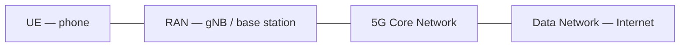
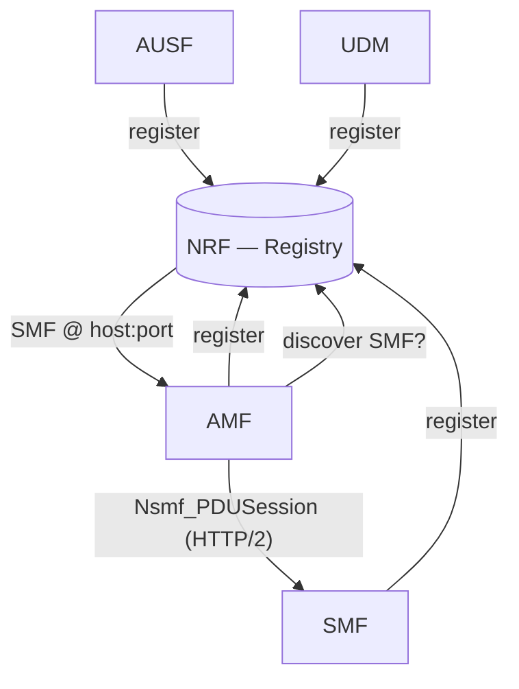
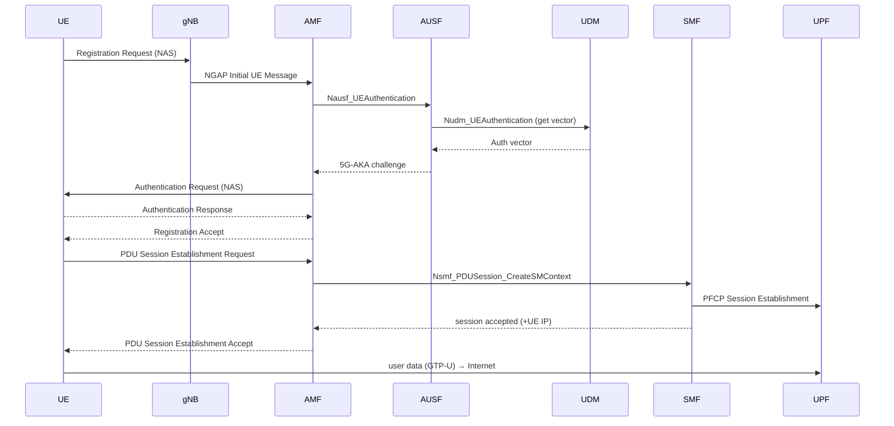

# 01 — 5G Architecture Primer

Read this before writing any code. These are the concepts every later document
assumes you know.

## 1. The three big pieces

- **UE** (User Equipment): the phone / device. In our lab it is *simulated*.
- **RAN** (Radio Access Network): the **gNB** (5G base station). Also *simulated*.
- **5GC** (5G Core): **what we build.** Control + user plane.
- **DN** (Data Network): the internet or a private network.

## 2. Control plane vs. user plane

5G strictly separates the two (**CUPS** — Control & User Plane Separation):

- **Control plane** = signalling. "Who are you, are you allowed, set up a session."
  Functions: AMF, SMF, AUSF, UDM, NRF, PCF…
- **User plane** = the actual data packets. One function: **UPF**.

The SMF (control) *programs* the UPF (user) over the **PFCP** protocol. This is the
key architectural idea: the brain (SMF) and the muscle (UPF) are separate and scale
independently.

## 3. Service-Based Architecture (SBA)

In 4G, network functions talked over rigid point-to-point interfaces. In 5G, the
**control-plane** functions are micro-services that expose **REST APIs over HTTP/2**.
This is the **Service-Based Interface (SBI)**.

- Each NF offers *services* (e.g. UDM offers `Nudm_UEAuthentication`).
- NFs find each other through the **NRF** (a service registry — think Consul/Eureka).
- Messages are JSON over HTTP/2, often using 3GPP-defined OpenAPI schemas.

> If you have built micro-services with service discovery, you already understand
> 80% of the 5G control plane. The other 20% is the radio-facing protocols below.

## 4. The protocols you will meet

| Protocol | Between | Transport | Purpose | In our project |
|----------|---------|-----------|---------|----------------|
| **NGAP** | gNB ↔ AMF | SCTP | Radio-network signalling (N2) | Reuse codec lib |
| **NAS** | UE ↔ AMF | carried inside NGAP | Mobility & session mgmt; auth | Reuse codec lib |
| **SBI** | NF ↔ NF | HTTP/2 + JSON | Service APIs (control plane) | **You implement** |
| **PFCP** | SMF ↔ UPF | UDP | Program user-plane forwarding rules (N4) | Reuse codec lib |
| **GTP-U** | gNB ↔ UPF, UPF ↔ DN | UDP/IP | Tunnel user data (N3) | Kernel module |

### Reference points (the "N" interfaces)
You'll see these names in specs and configs:

| Name | Connects | Carries |
|------|----------|---------|
| N1 | UE ↔ AMF | NAS signalling |
| N2 | gNB ↔ AMF | NGAP signalling |
| N3 | gNB ↔ UPF | user data (GTP-U) |
| N4 | SMF ↔ UPF | PFCP control |
| N6 | UPF ↔ DN | user data to internet |
| N11 | AMF ↔ SMF | SBI |
| N8 | AMF ↔ UDM | SBI |
| N12 | AMF ↔ AUSF | SBI |
| N13 | AUSF ↔ UDM | SBI |

## 5. Identities you must handle

| Identity | Meaning | Example |
|----------|---------|---------|
| **SUPI** | Subscriber Permanent Id (internal IMSI) | `imsi-208930000000001` |
| **SUCI** | *Concealed* SUPI sent over the air (privacy) | encrypted form of SUPI |
| **PLMN** | Public Land Mobile Network = MCC+MNC | `208 93` |
| **GUTI** | Temporary id the AMF assigns after registration | — |
| **DNN** | Data Network Name (like an APN) | `internet` |
| **S-NSSAI** | Slice identifier (SST + SD) | `1, 010203` |

## 6. Security in one paragraph (5G-AKA)

Authentication is **mutual**: the network proves itself to the UE and vice versa,
using a shared secret key **K** stored in the UE's SIM and in the **UDM**.
The UDM generates an *authentication vector* (challenge + expected response + keys).
The AUSF orchestrates the challenge/response. From the result, session keys are
derived to protect later signalling. You will implement the orchestration; the
crypto (MILENAGE/TUAK, key derivation functions) comes from libraries.

## 7. The end-to-end flow you are aiming for

Memorise this picture — the rest of the project is making each arrow real.

## Next

→ [02 — System Architecture](02-system-architecture.md)
