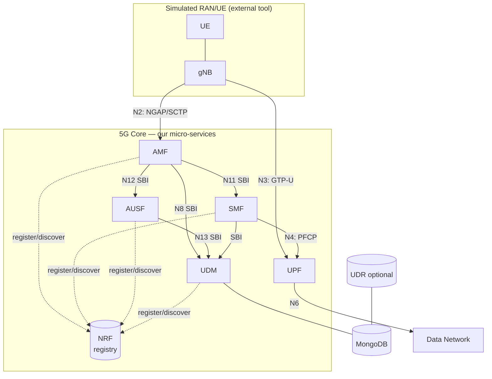
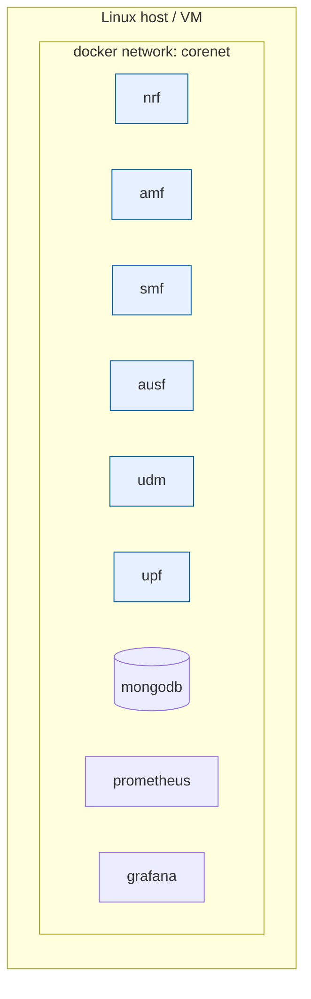

# 02 — System Architecture

This document defines the architecture of *our* prototype: components, boundaries,
internal structure of each NF, and the conventions every NF must follow.

## 1. Component diagram



## 2. Boundaries: what we build vs. what we reuse

| Component | Build? | Notes |
|-----------|--------|-------|
| NRF, AMF, SMF, AUSF, UDM | **Build** | Go micro-services, your code |
| UPF control (PFCP agent) | **Build** | Go service that programs the data path |
| UPF data path | **Reuse** | `gtp5g` kernel module + GTP-U |
| gNB + UE | **Reuse** | UERANSIM (or similar simulator) |
| NGAP/NAS/PFCP codecs | **Reuse** | Encoding libraries |
| MongoDB | **Reuse** | Off-the-shelf database |
| Prometheus/Grafana | **Reuse** | Observability stack |

## 3. Internal structure of a network function

Every NF follows the **same layered layout** so the codebase is uniform and you can
copy-paste the skeleton:

```
nf-name/
├── cmd/main.go            # entrypoint: load config, start servers
├── internal/
│   ├── context/           # in-memory state (subscribers, sessions, peers)
│   ├── sbi/               # HTTP/2 server: routes + handlers (the NF's API)
│   │   ├── api_*.go       # one file per service
│   │   └── server.go
│   ├── processor/         # business logic / state machines
│   ├── consumer/          # SBI *client* calls this NF makes to others
│   └── logger/            # structured logging
├── pkg/
│   ├── factory/           # config struct + loader (YAML)
│   └── service/           # wiring: init context, register to NRF, run
├── config/nf-name.yaml
├── Dockerfile
└── go.mod
```

**Rules of thumb**

- `sbi/` = *server* side (the APIs this NF exposes).
- `consumer/` = *client* side (calls this NF makes to other NFs).
- `processor/` = where decisions are made; keep handlers thin.
- `context/` = single source of in-memory truth for the NF.

## 4. Cross-cutting conventions (apply to all NFs)

| Concern | Convention |
|---------|-----------|
| Config | YAML file path via `-c` flag; struct in `pkg/factory` |
| Logging | Structured (JSON or key/value); include `nf`, `supi`, `trace_id` |
| Startup | 1) load config 2) init context 3) start SBI server 4) **register with NRF** |
| Shutdown | Deregister from NRF, drain, exit on SIGINT |
| Service discovery | Always resolve peers via NRF, never hard-code peer URLs |
| Health | Expose `GET /healthz` and `GET /metrics` (Prometheus) |
| IDs | Each NF has a UUID (`nfInstanceId`) generated at startup |

## 5. The `common` shared module

Put anything used by ≥2 NFs here to avoid duplication:

- SBI HTTP/2 client wrapper (with NRF discovery + retry).
- Shared data models (NF profile, subscriber, session) — see
  [09-data-model.md](09-data-model.md).
- Config base types, TLS helpers, logging setup, OpenAPI-style error responses.

## 6. Configuration model

Each NF reads a YAML config. Minimum fields:

```yaml
# example: amf.yaml
info:
  version: 0.1.0
  description: AMF prototype
configuration:
  amfName: AMF-1
  sbi:
    scheme: http
    bindingIp: 0.0.0.0
    port: 8000
  nrfUri: http://nrf:8000          # how to reach the registry
  ngapIpList: [0.0.0.0]            # SCTP listen for gNB (N2)
  plmnList:
    - mcc: "208"
      mnc: "93"
  supportedDnnList: [internet]
  security:
    integrityOrder: [NIA2]
    cipheringOrder: [NEA0]
```

## 7. Deployment view



The UPF additionally needs host networking / NET_ADMIN capability and the `gtp5g`
module on the host kernel. See [11-deployment-observability.md](11-deployment-observability.md).

## 8. Architectural decisions (record these in your report)

| Decision | Choice | Why |
|----------|--------|-----|
| Language | Go | Concurrency, static binaries, ecosystem for 5G |
| Service discovery | NRF (build it) | It's a core learning objective |
| Inter-NF transport | HTTP/2 + JSON | Matches 3GPP SBI |
| State storage | In-memory + MongoDB for subscribers | Simplicity for a prototype |
| Data path | `gtp5g` kernel module | Don't reinvent packet forwarding |

## Next

→ [03 — Technology Stack](03-technology-stack.md)
