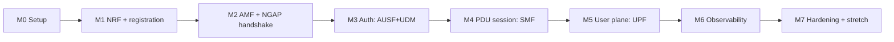
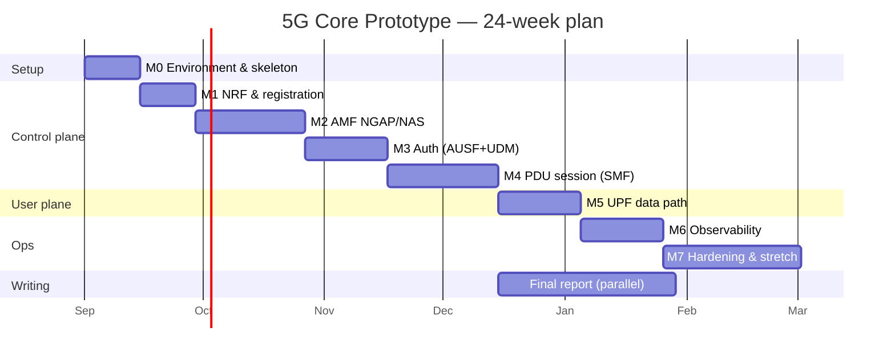

# 05 — Development Roadmap

The full phased plan: what to build, in what order, and how you know each stage is
done. Designed for a **4–6 month** internship (≈ 20–26 weeks).

## Guiding principle: vertical slices, not horizontal layers

Don't build all NFs to 100% one at a time. Build the **thinnest path** that gets a
packet a little further each milestone. Every milestone ends with something you can
**demonstrate**.

## Milestones

### M0 — Environment & skeleton (Week 1–2)
- Ubuntu VM, Go, gtp5g, MongoDB, UERANSIM all verified ([04](04-environment-setup.md)).
- Repo bootstrapped; shared `common` module with SBI client + logging skeleton.
- One NF skeleton that starts, reads config, exposes `/healthz` + `/metrics`.
- **Demo:** `curl localhost:8000/healthz` on the skeleton returns 200.

### M1 — NRF & service registration (Week 3–4)
- Implement NRF: `NFRegister`, `NFDeregister`, `NFDiscover`, `NFStatusNotify`.
- Make the skeleton NF register itself on startup and deregister on exit.
- **Demo:** two NFs register; one discovers the other via NRF; show NRF's registry.
- **Done when:** `GET /nnrf-nfm/v1/nf-instances` lists live NFs.

### M2 — AMF & the NGAP/NAS handshake (Week 5–8)
- AMF listens on SCTP (N2); handle NG Setup from the gNB simulator.
- Parse the UE **Registration Request** (NAS) from UERANSIM.
- Reply with NAS Identity/Registration messages (stub auth for now).
- **Demo:** UERANSIM gNB connects; UE reaches "registration started" in AMF logs.
- **Done when:** Wireshark shows a correct NGAP NG Setup + Initial UE Message.

### M3 — Authentication: AUSF + UDM (Week 9–11)
- UDM: store subscriber + key K; implement `GenerateAuthData` (auth vector).
- AUSF: implement `UEAuthentication` (5G-AKA orchestration).
- AMF: drive the NAS Authentication Request/Response exchange.
- **Demo:** a provisioned subscriber authenticates successfully end-to-end.
- **Done when:** UE moves to "Registered" state; AMF prints `5G-AKA success`.

### M4 — PDU session: SMF (Week 12–15)
- SMF: `CreateSMContext`, IP address allocation, session state machine.
- AMF ↔ SMF over N11; SMF ↔ UDM for session subscription data.
- UPF programming stubbed (return success) to validate control flow first.
- **Demo:** UE sends PDU Session Establishment Request → receives Accept + IP.
- **Done when:** UE shows an assigned IP; `uesimtun0` interface is created.

### M5 — User plane: UPF (Week 16–18)
- UPF: PFCP agent (N4); translate PFCP PDR/FAR into `gtp5g` rules.
- SMF: real PFCP Session Establishment toward UPF.
- GTP-U tunnel (N3) gNB↔UPF; N6 NAT to internet.
- **Demo:** `ping -I uesimtun0 8.8.8.8` succeeds. **This is the headline result.**
- **Done when:** sustained data flows UE → UPF → internet → UE.

### M6 — Observability (Week 19–21)
- Each NF exports Prometheus metrics (registrations, sessions, errors, latency).
- Prometheus scrapes; Grafana dashboard with the core KPIs.
- Structured logs with a correlation id across NFs.
- **Demo:** register/attach a UE and watch counters move live on Grafana.

### M7 — Hardening, packaging & stretch (Week 22–26)
- Full `docker compose up` brings up the entire core reproducibly.
- CI (GitHub Actions): build + unit tests on every push.
- Load test (multiple UEs); fault scenarios (kill an NF, observe recovery).
- **Stretch (pick what time allows):** PCF (basic policy), NSSF (slice select),
  multiple DNNs, deregistration/cleanup, Kubernetes/Helm deployment.
- Final report + demo video.

## Timeline (Gantt)

## Effort weighting (where the time really goes)

| Area | Share of effort | Why |
|------|-----------------|-----|
| AMF + NGAP/NAS (M2) | ~25% | Radio-facing protocols are the hardest part |
| SMF + PDU session (M4) | ~20% | State machine + UDM/UPF coordination |
| UPF data path (M5) | ~15% | Kernel module + PFCP translation |
| Auth (M3) | ~12% | Crypto orchestration, key derivation |
| NRF (M1) | ~8% | Conceptually simple registry |
| Observability + ops (M6–M7) | ~20% | Containers, metrics, testing, report |

## Risk-driven ordering rationale

- **NRF first** because everything else registers/discovers through it.
- **AMF before auth** so you can see the UE arrive before adding security.
- **Stub the UPF in M4** so control-plane bugs are isolated from data-path bugs.
- **Observability late** but not last, so you can debug M5 with real metrics.

## Per-milestone "Definition of Done" template

For each milestone, record:
- [ ] Feature implemented and unit-tested
- [ ] Verified on the wire (Wireshark capture saved)
- [ ] Demo reproducible from a script
- [ ] Notes added to the report
- [ ] Code reviewed / merged to `main`

## Next

→ [06 — Network Function Specs](06-network-functions/README.md)
