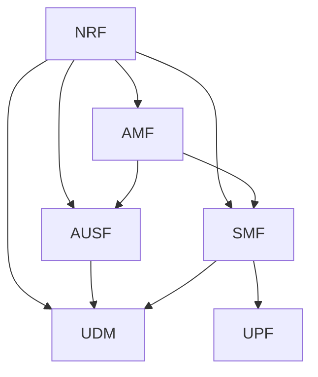

# 06 — Network Function Specifications

One spec per network function in the MVP. Each spec follows the same template:

- **Responsibility** — what the NF owns
- **Interfaces** — who it talks to and over what
- **Services exposed** — its SBI API surface (server side)
- **Services consumed** — calls it makes to others (client side)
- **Internal state** — what it keeps in memory / DB
- **Core logic** — the algorithms / state machine
- **Build checklist** — ordered tasks to implement it

## The six MVP functions

| Spec | NF | Build order (from roadmap) |
|------|----|----------------------------|
| [NRF](nrf.md) | Network Repository Function | M1 — first |
| [AMF](amf.md) | Access & Mobility Management | M2 |
| [AUSF](ausf.md) | Authentication Server | M3 |
| [UDM](udm.md) | Unified Data Management | M3 |
| [SMF](smf.md) | Session Management | M4 |
| [UPF](upf.md) | User Plane | M5 |

## Dependency graph

Build NRF first (everyone depends on it), then AMF (the orchestrator), then the
functions it calls.
