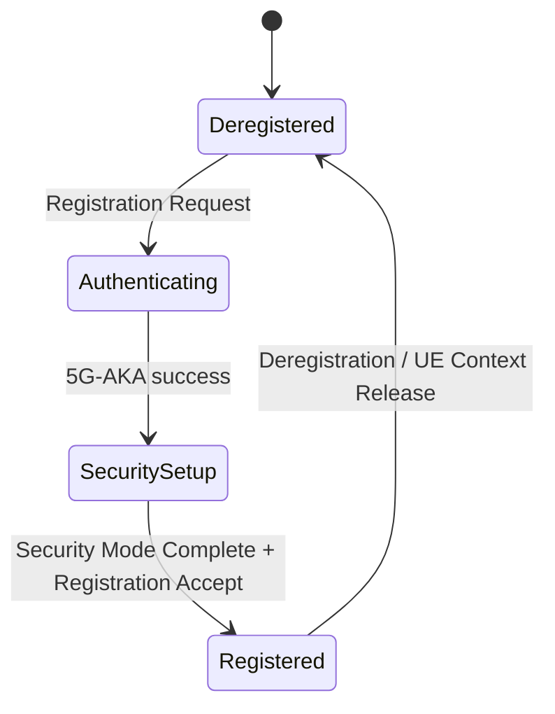

# AMF — Access & Mobility Management Function

The **orchestrator** of the control plane and the only NF that talks to the radio.
This is the largest and hardest NF — budget ~25% of the project here.

## Responsibility
- Terminate **N2 (NGAP/SCTP)** from the gNB and **N1 (NAS)** from the UE.
- Manage UE registration & connection state.
- Drive authentication (via AUSF) and PDU sessions (via SMF).

## Interfaces
| Peer | Direction | Transport | Reference point |
|------|-----------|-----------|-----------------|
| gNB | in/out | SCTP / NGAP | N2 |
| UE | in/out | NAS (inside NGAP) | N1 |
| AUSF | out | SBI HTTP/2 | N12 |
| UDM | out | SBI HTTP/2 | N8 |
| SMF | out | SBI HTTP/2 | N11 |
| NRF | out | SBI HTTP/2 | register/discover |

## Services exposed (server side)
### `Namf_Communication`
| Method | Path | Purpose |
|--------|------|---------|
| POST | `/namf-comm/v1/ue-contexts/{ueContextId}/n1-n2-messages` | SMF→AMF: send NAS/N2 to UE |

### `Namf_EventExposure` (optional, stretch)

## Services consumed (client side)
| Target | Service | When |
|--------|---------|------|
| AUSF | `Nausf_UEAuthentication` | during registration |
| UDM | `Nudm_UECM` / `Nudm_SDM` | registration + subscription data |
| SMF | `Nsmf_PDUSession_CreateSMContext` | PDU session setup |
| NRF | discovery | to locate AUSF/SMF/UDM |

## NGAP procedures to implement (N2)
| Procedure | Trigger |
|-----------|---------|
| NG Setup | gNB connects |
| Initial UE Message | UE first appears |
| Downlink/Uplink NAS Transport | carry NAS both ways |
| Initial Context Setup | after auth, before/with session |
| PDU Session Resource Setup | establish user-plane bearer |
| UE Context Release | teardown |

## NAS procedures to implement (N1)
| Procedure | Messages |
|-----------|----------|
| Registration | Registration Request/Accept/Complete |
| Authentication | Authentication Request/Response |
| Security Mode Control | Security Mode Command/Complete |
| PDU Session (transport) | forwards the NAS SM container to/from SMF |

## Internal state
```text
ueContexts: map[ueId] -> {
    supi, guti, ranUeNgapId, amfUeNgapId,
    ngksi, securityContext, ratType, plmn,
    registrationState, cmState,
    pduSessions: map[pduSessionId] -> smContextRef
}
ranContexts: map[sctpAssoc] -> gNB info
```

## State machine (UE registration)


## Build checklist
1. [ ] SCTP listener (N2); accept gNB; handle **NG Setup**.
2. [ ] NGAP decode/encode wired to the codec library.
3. [ ] Handle **Initial UE Message**; extract the NAS PDU.
4. [ ] NAS decode; recognise **Registration Request**.
5. [ ] Call AUSF; run **Authentication Request/Response** over NAS.
6. [ ] **Security Mode Command/Complete**; establish NAS security.
7. [ ] Send **Registration Accept**; allocate GUTI.
8. [ ] Handle **PDU Session Establishment** NAS → call SMF over N11.
9. [ ] **PDU Session Resource Setup** toward gNB (N2) with UPF tunnel info.
10. [ ] Register with NRF; expose `/metrics` (registered UEs, active sessions).

## Demo checkpoints
- End of M2: gNB NG Setup + UE Initial Message visible in logs & Wireshark.
- End of M3: UE reaches **Registered**.
- End of M4: PDU session NAS exchange completes.
