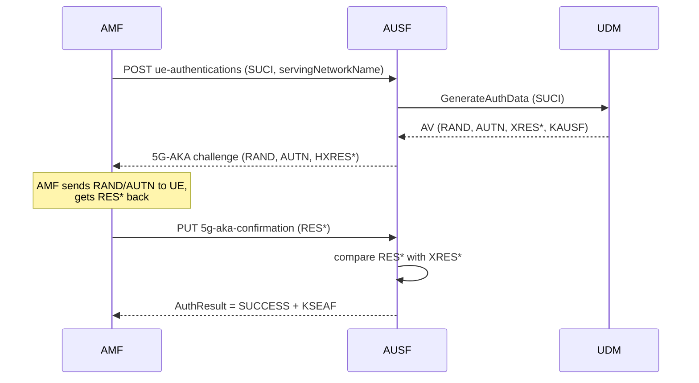

# AUSF — Authentication Server Function

## Responsibility
Orchestrates **UE authentication** (5G-AKA). Sits between the AMF (which asks "is
this UE genuine?") and the UDM (which holds the keys and generates the vector).
The AUSF itself does not store long-term keys.

## Interfaces
| Peer | Direction | Transport | Reference point |
|------|-----------|-----------|-----------------|
| AMF | inbound | SBI HTTP/2 | N12 |
| UDM | outbound | SBI HTTP/2 | N13 |
| NRF | outbound | SBI HTTP/2 | register/discover |

## Services exposed
### `Nausf_UEAuthentication`
| Method | Path | Purpose |
|--------|------|---------|
| POST | `/nausf-auth/v1/ue-authentications` | Start auth; AMF sends SUCI/SUPI + serving network |
| PUT | `/nausf-auth/v1/ue-authentications/{authCtxId}/5g-aka-confirmation` | AMF returns the UE's RES* for verification |

## Services consumed
| Target | Service | Purpose |
|--------|---------|---------|
| UDM | `Nudm_UEAuthentication_Get` | Obtain the 5G-AKA authentication vector |

## 5G-AKA flow (what the AUSF coordinates)


## Internal state
```text
authContexts: map[authCtxId] -> {
    supi, servingNetworkName,
    xresStar, hxresStar, kausf, kseaf,
    state  // PENDING / SUCCESS / FAILURE
}
```

## Core logic
1. On POST: ask UDM for the auth vector; compute `HXRES*` from `XRES*`; store
   context; return the challenge (RAND, AUTN, HXRES*) to the AMF.
2. On PUT (confirmation): compare the UE's `RES*` against stored `XRES*`.
   - Match → derive `KSEAF`, return `SUCCESS`.
   - Mismatch → return `FAILURE`.

> The cryptography (MILENAGE, key derivation functions) is provided by a library.
> Your job is the orchestration and state handling.

## Build checklist
1. [ ] Register with NRF.
2. [ ] POST handler: call UDM, build challenge, store context.
3. [ ] Compute `HXRES*` and `KSEAF` via the crypto library.
4. [ ] PUT handler: verify `RES*`, return result.
5. [ ] Error paths (unknown SUPI, sync failure, timeout).
6. [ ] `/metrics`: auth attempts, successes, failures.
7. [ ] Unit test with a known test vector (deterministic K, RAND).

## Demo (M3)
A provisioned subscriber authenticates; logs show `AuthResult: SUCCESS`.
