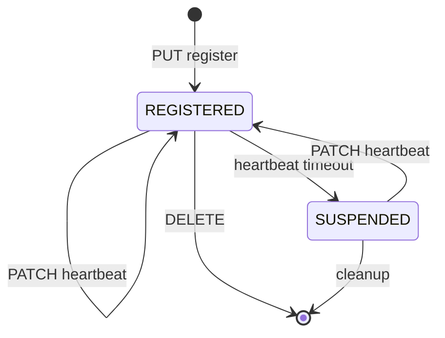

# NRF — Network Repository Function

## Responsibility
The service registry of the 5G Core. Every other NF **registers** here at startup;
NFs **discover** each other by querying the NRF. Think Consul/Eureka for 5G.

## Interfaces
| Peer | Direction | Transport | Purpose |
|------|-----------|-----------|---------|
| All NFs | inbound | SBI HTTP/2 | register / discover / status |

## Services exposed (server side)

### `Nnrf_NFManagement`
| Method | Path | Purpose |
|--------|------|---------|
| PUT | `/nnrf-nfm/v1/nf-instances/{nfInstanceId}` | Register / update an NF |
| PATCH | `/nnrf-nfm/v1/nf-instances/{nfInstanceId}` | Partial update (heartbeat) |
| DELETE | `/nnrf-nfm/v1/nf-instances/{nfInstanceId}` | Deregister |
| GET | `/nnrf-nfm/v1/nf-instances` | List all NF instances |

### `Nnrf_NFDiscovery`
| Method | Path | Purpose |
|--------|------|---------|
| GET | `/nnrf-disc/v1/nf-instances?target-nf-type=SMF&requester-nf-type=AMF` | Find NFs of a type |

### Optional
- `NFStatusSubscribe/Notify` — notify subscribers when an NF appears/disappears.

## Services consumed
None (NRF is a leaf — everyone calls it).

## Internal state
```text
registry: map[nfInstanceId] -> NFProfile
```
See the `NFProfile` schema in [../09-data-model.md](../09-data-model.md).
Keep it in memory; optionally persist to MongoDB for restarts.

## Core logic
- **Register:** validate profile, store, start a heartbeat timer.
- **Heartbeat:** if no PATCH within `heartBeatTimer` seconds → mark `SUSPENDED`,
  later remove.
- **Discover:** filter the registry by `target-nf-type` (+ optional service name,
  S-NSSAI, DNN) and return matching profiles.



## Build checklist
1. [ ] HTTP/2 server with the routes above (Gin or stdlib).
2. [ ] In-memory registry with a mutex.
3. [ ] `PUT` register: store profile, return 201 + `Location` header.
4. [ ] `GET` discovery with `target-nf-type` filtering.
5. [ ] Heartbeat timer + status transitions.
6. [ ] `DELETE` deregister.
7. [ ] `/metrics`: gauge of registered NFs by type.
8. [ ] Unit tests: register → discover → deregister.

## Demo (end of M1)
```bash
# start NRF, then register a fake NF
curl -X PUT localhost:8000/nnrf-nfm/v1/nf-instances/abc \
  -H 'Content-Type: application/json' \
  -d '{"nfInstanceId":"abc","nfType":"SMF","nfStatus":"REGISTERED","ipv4Addresses":["10.0.0.5"]}'
# discover SMFs
curl 'localhost:8000/nnrf-disc/v1/nf-instances?target-nf-type=SMF&requester-nf-type=AMF'
```
