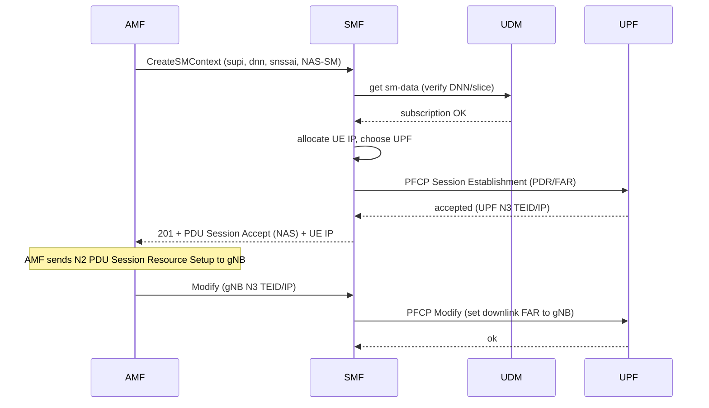
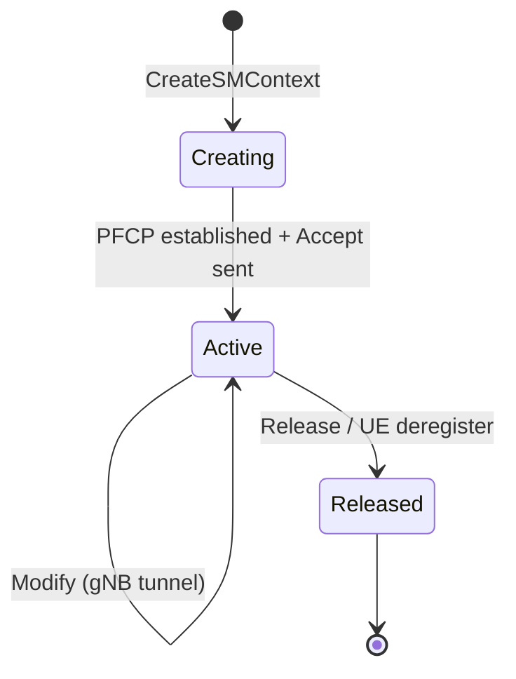

# SMF — Session Management Function

## Responsibility
Manages **PDU sessions**: the data connections a UE uses to reach a data network.
Allocates the UE's IP address, selects a UPF, and **programs the UPF** over PFCP
(N4). The control-plane brain of the user plane.

## Interfaces
| Peer | Direction | Transport | Reference point |
|------|-----------|-----------|-----------------|
| AMF | inbound | SBI HTTP/2 | N11 |
| UDM | outbound | SBI HTTP/2 | session subscription |
| UPF | out/in | PFCP (UDP) | N4 |
| NRF | outbound | SBI HTTP/2 | register/discover |

## Services exposed
### `Nsmf_PDUSession`
| Method | Path | Purpose |
|--------|------|---------|
| POST | `/nsmf-pdusession/v1/sm-contexts` | Create SM context (AMF on session request) |
| POST | `/nsmf-pdusession/v1/sm-contexts/{id}/modify` | Modify (e.g. add gNB tunnel info) |
| POST | `/nsmf-pdusession/v1/sm-contexts/{id}/release` | Release the session |

## Services consumed
| Target | Service | Purpose |
|--------|---------|---------|
| UDM | `Nudm_SDM sm-data` | Allowed DNN / slice / default QoS |
| UPF | PFCP | Establish/modify/delete forwarding rules |
| NRF | discovery | Locate UDM/UPF |

## PDU session establishment flow


## Key concepts
| Term | Meaning |
|------|---------|
| **PDR** | Packet Detection Rule — "match packets like this" |
| **FAR** | Forwarding Action Rule — "do this with them" (forward/drop/buffer) |
| **TEID** | Tunnel Endpoint ID for GTP-U |
| **QER/URR** | QoS / Usage-reporting rules (stretch) |

For an uplink path: PDR matches packets from the UE tunnel → FAR forwards to N6.
For downlink: PDR matches packets from N6 to the UE IP → FAR forwards to the gNB
tunnel (TEID learned in the Modify step).

## Internal state
```text
smContexts: map[smContextRef] -> {
    supi, pduSessionId, dnn, snssai,
    ueIpAddr, selectedUpf,
    upfN3 {teid, ip}, gnbN3 {teid, ip},
    pfcpSeid, state
}
ipPool: allocator for the DNN subnet (e.g. 10.60.0.0/16)
```

## State machine


## Build checklist
1. [ ] Register with NRF; PFCP socket toward UPF.
2. [ ] `CreateSMContext`: validate via UDM, allocate IP from pool.
3. [ ] Build PFCP Session Establishment (uplink PDR/FAR) → UPF.
4. [ ] Return PDU Session Establishment Accept (NAS-SM) + UE IP to AMF.
5. [ ] `Modify`: receive gNB N3 tunnel info; PFCP Modify (downlink FAR).
6. [ ] `Release`: PFCP Session Deletion; free IP.
7. [ ] `/metrics`: active sessions, establishment success/fail.

## Demo
- M4: UE receives an IP (PFCP stubbed).
- M5: with real PFCP, data actually flows (see UPF spec).
