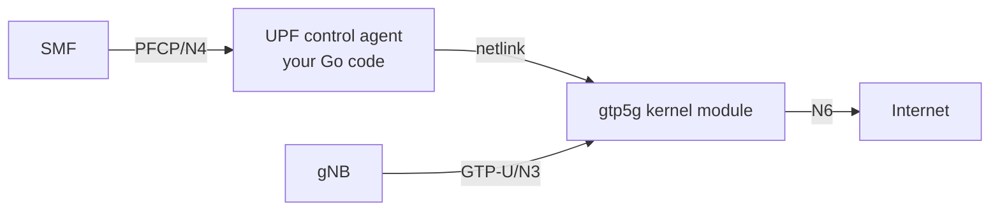

# UPF — User Plane Function

## Responsibility
The **only user-plane** function: it forwards actual subscriber packets. Receives
forwarding rules from the SMF over **PFCP (N4)**, and moves packets between the
gNB tunnel (**N3, GTP-U**) and the data network (**N6**).

This is the one NF where you **reuse a kernel module** (`gtp5g`) for the fast path;
your code is the PFCP control agent that programs it.

## Interfaces
| Peer | Direction | Transport | Reference point |
|------|-----------|-----------|-----------------|
| SMF | inbound | PFCP (UDP) | N4 |
| gNB | in/out | GTP-U (UDP) | N3 |
| Data network | in/out | IP | N6 |

## Architecture


## What your code does (the PFCP agent)
1. Listen for PFCP on N4.
2. Handle **Association Setup** with the SMF (handshake).
3. On **Session Establishment**: translate PDRs/FARs into `gtp5g` rules via netlink:
   - create a GTP-U tunnel device,
   - install uplink rule (UE tunnel → N6, with NAT),
   - reserve downlink TEID for the UE IP.
4. On **Session Modification**: set the downlink FAR to the gNB's N3 TEID/IP.
5. On **Session Deletion**: remove the rules and tunnel.
6. Send PFCP responses back to the SMF.

## PFCP message handling
| Message | Action |
|---------|--------|
| Association Setup Request/Response | establish SMF↔UPF relationship |
| Heartbeat Request/Response | keepalive |
| Session Establishment Request/Response | install PDR/FAR in gtp5g |
| Session Modification Request/Response | update FAR (downlink to gNB) |
| Session Deletion Request/Response | remove rules |

## Packet path once programmed
```text
Uplink:   UE → gNB → (GTP-U N3) → UPF/gtp5g → decapsulate → NAT → N6 → Internet
Downlink: Internet → N6 → UPF/gtp5g → match UE IP → encapsulate (GTP-U) → gNB → UE
```

## Internal state
```text
associations: map[smfId] -> assoc state
sessions:     map[seid]  -> {pdrs, fars, gtpDev, ueIp, n3Teids}
```

## Build checklist
1. [ ] PFCP UDP socket on N4; decode/encode via PFCP library.
2. [ ] Association Setup + Heartbeat with SMF.
3. [ ] Create/attach a `gtp5g` GTP-U device on startup.
4. [ ] Session Establishment → program uplink PDR/FAR (netlink to gtp5g).
5. [ ] Session Modification → program downlink FAR with gNB TEID.
6. [ ] N6 egress: enable IP forwarding + MASQUERADE (NAT).
7. [ ] Session Deletion → tear down rules.
8. [ ] `/metrics`: active sessions, packets/bytes per direction.

## Environment requirements
- Linux kernel with `gtp5g` loaded (`lsmod | grep gtp5g`).
- Container/process needs `NET_ADMIN` capability and host networking.
- `net.ipv4.ip_forward=1` and a MASQUERADE rule on the N6 uplink.

See [../04-environment-setup.md](../04-environment-setup.md).

## Demo (M5 — the headline result)
```bash
# inside the UE simulator after PDU session is up
ping -I uesimtun0 8.8.8.8
# success = the entire core works end to end
```
