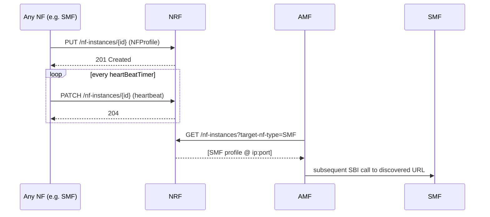
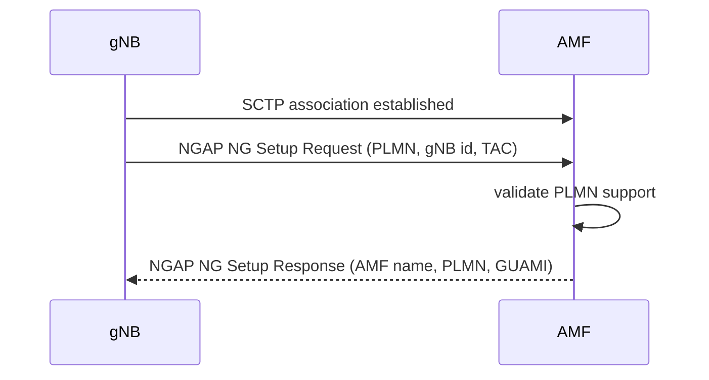
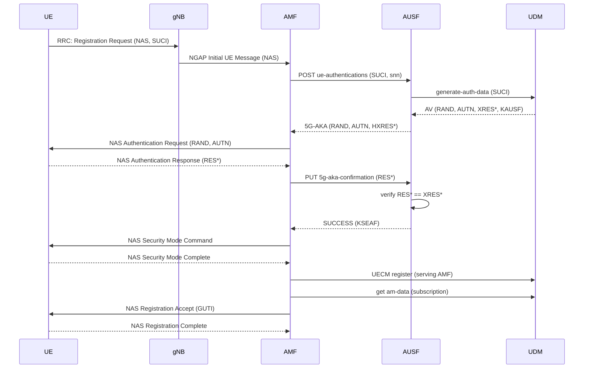
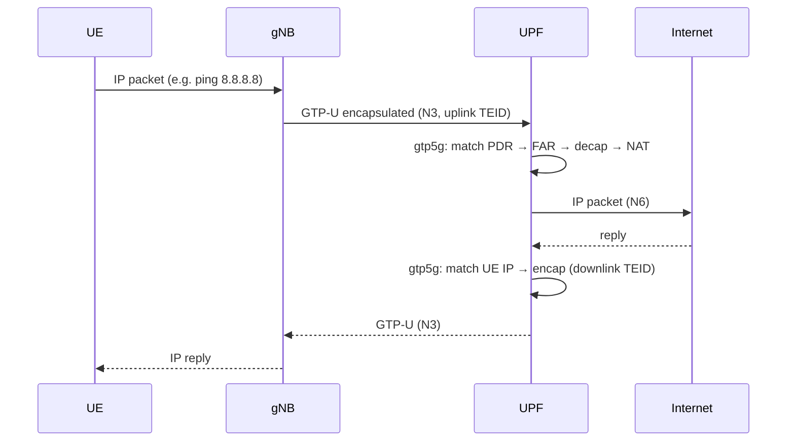
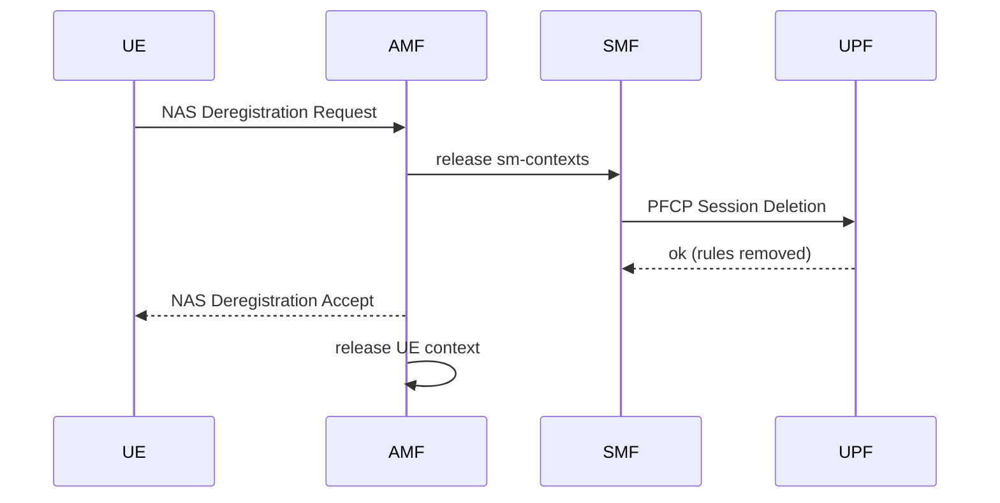

# 07 — Call Flows

The signalling sequences you must implement, in the order the roadmap builds them.
Implement them incrementally — each flow is a milestone.

---

## 1. NF registration & discovery (M1)



**Implement:** register on startup, heartbeat loop, discovery query, deregister on
shutdown.

---

## 2. gNB attach — NG Setup (M2)



**Implement:** SCTP listener, NGAP decode, PLMN check, NG Setup Response.

---

## 3. UE registration + 5G-AKA authentication (M2→M3)



**Implement (M2):** up to Authentication Request being sent.
**Implement (M3):** full exchange to **Registration Complete**.

---

## 4. PDU session establishment (M4 control, M5 data)

```mermaid
sequenceDiagram
    participant UE
    participant gNB
    participant AMF
    participant SMF
    participant UDM
    participant UPF

    UE->>AMF: NAS PDU Session Establishment Request (DNN, S-NSSAI, PDU id)
    AMF->>SMF: POST sm-contexts (supi, dnn, snssai, NAS-SM)
    SMF->>UDM: get sm-data (verify DNN/slice)
    UDM-->>SMF: subscription OK
    SMF->>SMF: allocate UE IP; select UPF
    SMF->>UPF: PFCP Session Establishment (uplink PDR/FAR)
    UPF-->>SMF: accepted (UPF N3 TEID/IP)
    SMF-->>AMF: 201 + NAS PDU Session Accept (UE IP) + N2 info
    AMF->>gNB: NGAP PDU Session Resource Setup (UPF TEID)
    gNB-->>AMF: PDU Session Resource Setup Response (gNB TEID)
    AMF->>SMF: POST sm-contexts/{id}/modify (gNB TEID)
    SMF->>UPF: PFCP Modify (downlink FAR → gNB)
    UPF-->>SMF: ok
    Note over UE,UPF: Data plane now active (GTP-U)
```

**Implement (M4):** everything except real PFCP (UPF returns stub success; UE gets IP).
**Implement (M5):** real PFCP + gtp5g; data actually flows.

---

## 5. User-plane data path (M5)



---

## 6. Deregistration / release (M7 stretch)



---

## Verification tip
For **every** flow, capture it with Wireshark and save the `.pcap` next to the
milestone notes. Wireshark decodes NGAP, NAS, PFCP, and GTP natively — it is your
single best debugging tool. Compare your messages against a reference trace from a
known-good core.

## Next
→ [08 — SBI API Design](08-sbi-api-design.md)
