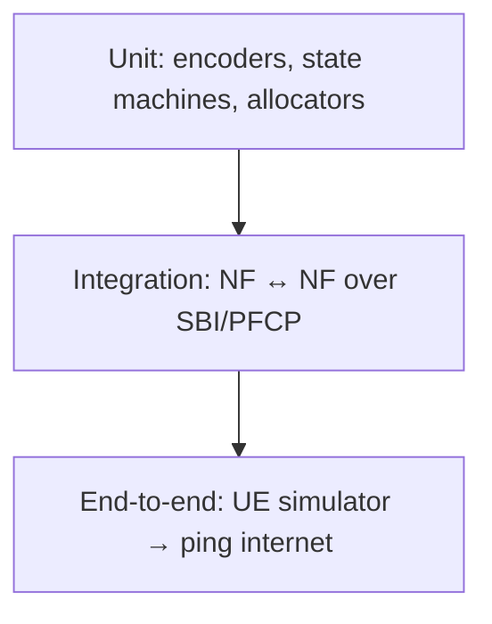

# 10 — Testing & Validation

How to prove each milestone works — to yourself, your supervisor, and the jury.

## 1. Testing pyramid



| Layer | Tooling | Examples |
|-------|---------|----------|
| Unit | `go test` | IP allocator, SUCI→SUPI, NFProfile filter, auth vector vs. known vector |
| Integration | `go test` + httptest / docker | AMF→AUSF auth, SMF→UPF PFCP |
| End-to-end | UERANSIM + scripts | full registration + ping |

## 2. Unit testing essentials
- **Auth (M3):** test against a *known 5G-AKA test vector* (fixed K, OPc, RAND →
  expected RES/AUTN). Deterministic and catches crypto wiring bugs early.
- **NRF (M1):** register N profiles, assert discovery filters by type/slice.
- **SMF IP pool (M4):** allocate/free, exhaustion, no double-allocation.
- **NAS/NGAP (M2):** encode then decode a message, assert round-trip equality.

## 3. Integration testing
Spin up two real NFs (or use `httptest`) and assert the SBI exchange:
```go
// pseudocode
func TestAuthFlow(t *testing.T) {
    udm := startUDM(testSubscriber)
    ausf := startAUSF(udm.URL)
    resp := ausf.POST("/nausf-auth/v1/ue-authentications", body)
    assert.Equal(t, "5G_AKA", resp.AuthType)
    // ... confirm with correct RES* → SUCCESS
}
```

## 4. End-to-end with UERANSIM

### Config
- Point UERANSIM gNB at your AMF's N2 IP/port.
- Provision the matching subscriber (SUPI, K, OPc) in MongoDB.

### Run
```bash
# terminal 1: gNB
./build/nr-gnb -c config/free5gc-gnb.yaml
# terminal 2: UE
sudo ./build/nr-ue -c config/free5gc-ue.yaml
# terminal 3: verify
ip a show uesimtun0                 # tunnel exists → PDU session up
ping -I uesimtun0 -c 4 8.8.8.8      # data path works
```

### Pass criteria per milestone
| Milestone | E2E check |
|-----------|-----------|
| M2 | gNB shows "NG Setup successful"; AMF logs Initial UE Message |
| M3 | UE shows `5GMM-REGISTERED` |
| M4 | `uesimtun0` appears with an IP |
| M5 | `ping` over `uesimtun0` returns replies |

## 5. Packet-level validation (Wireshark / tcpdump)
Capture and **save a pcap for every milestone** as evidence:
```bash
sudo tcpdump -i any -w m3-auth.pcap \
  'sctp port 38412 or tcp port 8000 or udp port 8805 or udp port 2152'
```
Wireshark decodes NGAP, NAS-5GS, PFCP, GTP. Verify:
- NGAP NG Setup Response present.
- NAS Authentication Request/Response with sane IEs.
- PFCP Session Establishment with PDR/FAR.
- GTP-U packets on port 2152 during ping.

## 6. Load & resilience (M7)
| Test | How | Watch |
|------|-----|-------|
| Many UEs | UERANSIM multi-UE / PacketRusher | sessions counter, latency, errors |
| NF restart | `docker restart amf` mid-traffic | re-registration, recovery |
| NRF down | stop NRF | discovery failures handled gracefully |
| UPF restart | restart UPF | session re-establishment behaviour |

## 7. KPIs to measure (feed Grafana)
- Registration success rate & mean registration time.
- Active PDU sessions.
- Uplink/downlink throughput (Mbps) and packet loss.
- SBI call latency per service.
- Auth success/failure counts.

## 8. CI (GitHub Actions)
```yaml
name: ci
on: [push, pull_request]
jobs:
  build-test:
    runs-on: ubuntu-latest
    steps:
      - uses: actions/checkout@v4
      - uses: actions/setup-go@v5
        with: { go-version: '1.26' }
      - run: go build ./...
      - run: go test ./... -race -cover
      - run: golangci-lint run || true
```

## 9. Test evidence to keep for the report
- [ ] pcap per milestone
- [ ] screenshots: UE registered, `ping` success, Grafana dashboard
- [ ] `go test -cover` output
- [ ] a short demo video of the full flow

## Next
→ [11 — Deployment & Observability](11-deployment-observability.md)
