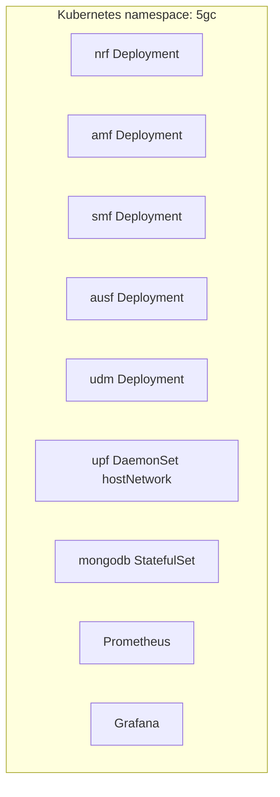

# 11 — Deployment & Observability

How to package, run, and monitor the whole core reproducibly.

## 1. Per-NF Dockerfile (template)
```dockerfile
# build stage
FROM golang:1.26 AS build
WORKDIR /src
COPY . .
RUN CGO_ENABLED=0 go build -o /out/nf ./cmd

# run stage
FROM alpine:3.20
RUN adduser -D app
COPY --from=build /out/nf /usr/local/bin/nf
COPY config/ /config/
USER app
ENTRYPOINT ["nf", "-c", "/config/nf.yaml"]
```
> The **UPF is special**: it needs `NET_ADMIN`, host networking, and the host's
> `gtp5g` module. Do not run it in a minimal sandboxed container.

## 2. docker-compose.yml (control plane + infra)
```yaml
services:
  mongodb:
    image: mongo:7.0
    volumes: [ "dbdata:/data/db" ]
    networks: [ corenet ]

  nrf:
    build: ./nrf
    networks: [ corenet ]

  udm:
    build: ./udm
    depends_on: [ nrf, mongodb ]
    networks: [ corenet ]

  ausf:
    build: ./ausf
    depends_on: [ nrf ]
    networks: [ corenet ]

  amf:
    build: ./amf
    depends_on: [ nrf, ausf, udm ]
    ports: [ "38412:38412/sctp" ]   # N2 from gNB
    networks: [ corenet ]

  smf:
    build: ./smf
    depends_on: [ nrf, udm ]
    networks: [ corenet ]

  upf:
    build: ./upf
    cap_add: [ NET_ADMIN ]
    privileged: true
    network_mode: host              # needs host kernel + gtp5g
    depends_on: [ smf ]

  prometheus:
    image: prom/prometheus
    volumes: [ "./deploy/observability/prometheus.yml:/etc/prometheus/prometheus.yml" ]
    ports: [ "9090:9090" ]
    networks: [ corenet ]

  grafana:
    image: grafana/grafana
    ports: [ "3000:3000" ]
    networks: [ corenet ]

networks: { corenet: {} }
volumes: { dbdata: {} }
```

Bring it up:
```bash
docker compose up -d
docker compose ps
docker compose logs -f amf
```

## 3. Prometheus scrape config
```yaml
# deploy/observability/prometheus.yml
global: { scrape_interval: 5s }
scrape_configs:
  - job_name: 5gc
    static_configs:
      - targets: [ "nrf:8000", "amf:8000", "smf:8000", "ausf:8000", "udm:8000" ]
    metrics_path: /metrics
```

## 4. Metrics each NF should export
```go
// common/metrics
var (
  Registrations = prometheus.NewCounterVec(
     prometheus.CounterOpts{Name: "fivegc_registrations_total"},
     []string{"nf","result"})
  ActiveSessions = prometheus.NewGauge(
     prometheus.GaugeOpts{Name: "fivegc_active_pdu_sessions"})
  SbiLatency = prometheus.NewHistogramVec(
     prometheus.HistogramOpts{Name: "fivegc_sbi_request_seconds"},
     []string{"nf","service","method"})
)
```
| NF | Key metrics |
|----|-------------|
| NRF | registered NFs by type |
| AMF | registered UEs, registration success/fail, NGAP events |
| AUSF | auth attempts/success/fail |
| SMF | active sessions, establishment success/fail |
| UPF | active sessions, packets/bytes per direction |

## 5. Grafana dashboard panels
- Registered UEs (stat) and registration success rate (gauge).
- Active PDU sessions over time (time series).
- Uplink/downlink throughput (time series, from UPF).
- SBI latency p50/p95 per service (heatmap).
- Auth success vs. failure (bar).

Provision it as JSON in `deploy/observability/grafana/dashboards/`.

## 6. Structured logging + correlation
Emit JSON logs; carry a `trace_id` from the AMF through every SBI call so you can
follow one UE across all NFs:
```json
{"ts":"...","level":"info","nf":"smf","trace_id":"7f3a","supi":"imsi-2089...","msg":"PDU session ACTIVE","ue_ip":"10.60.0.1"}
```
Optionally add **OpenTelemetry** tracing → Jaeger for visual call graphs (stretch).

## 7. Kubernetes (stretch, M7)
- One `Deployment` + `Service` per NF; `ConfigMap` for YAML config.
- `StatefulSet` for MongoDB.
- UPF as a `DaemonSet` with `hostNetwork: true` + privileged (needs the node's
  `gtp5g`).
- Package as a **Helm chart** with a `values.yaml` exposing PLMN, DNN, image tags.
- Use the Prometheus Operator + a Grafana dashboard ConfigMap.



## 8. One-command developer experience (target)
```bash
make up        # docker compose up -d + provision a test subscriber
make ue        # run UERANSIM gNB+UE
make ping      # ping over uesimtun0
make down      # tear everything down
```

## Next
→ [12 — Glossary](12-glossary.md)
