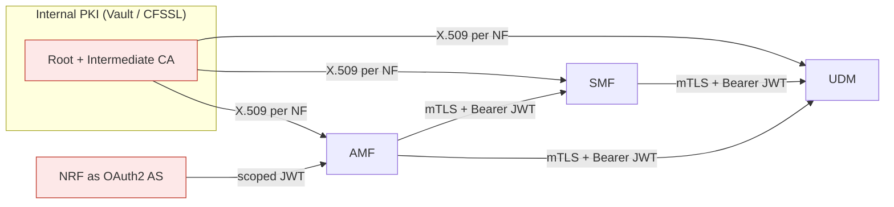

# 14 — Zero-Trust Security Architecture

> This is the project's **first differentiating layer**. None of the mainstream
> open-source 5G cores (open5GS, free5GC, OAI) ship mTLS between NFs, certificate-based
> NF identity, or zero-trust network policy by default. This chapter specifies what we
> add on top of the MVP from chapters 00–13.

**Principle:** *No NF trusts another NF by default, regardless of network position.*
Every inter-NF call must be authenticated **and** authorised.

## 1. Mutual TLS on the SBI (TLS 1.3)
- Deploy a lightweight internal PKI (HashiCorp Vault PKI engine, or CFSSL/cert-manager)
  to issue an **X.509 certificate per NF instance**, SAN = NF instance ID.
- Every HTTP/2 SBI call requires **client-certificate presentation**; a server rejects
  any peer without a valid, in-date cert (TLS handshake failure).
- **Certificate rotation is automated** and exercised as part of the deploy pipeline
  (see fault scenario SEC / `Certificate expiry` in [16](16-conformance-test-framework.md)).

**Done when:** an SBI call from an NF presenting no/expired cert fails at the TLS layer,
proven by `SEC-01`.

## 2. OAuth2 / JWT authorisation (3GPP TS 33.501 §13)
- The **NRF acts as the OAuth2 authorisation server**, issuing access tokens scoped to
  specific NF service operations.
- AMF, SMF, UDM validate the bearer token on **every** inbound SBI request; a missing or
  expired token → **HTTP 401**, a wrong scope → **HTTP 403**.
- Token scopes map directly to 3GPP NF service names, e.g. `namf-comm`, `nsmf-pdusession`,
  `nudm-sdm`.

| Caller | Callee | Required scope |
|--------|--------|----------------|
| AMF | UDM | `nudm-sdm`, `nudm-ueau` |
| AMF | SMF | `nsmf-pdusession` |
| SMF | UDM | `nudm-sdm` |
| AUSF | UDM | `nudm-ueau` |

**Done when:** `SEC-02` (token scope violation) returns HTTP 403.

## 3. Network-policy enforcement
- Kubernetes NetworkPolicies (or **Cilium L7** policies in the K8s track) enforce that
  only permitted NF pairs can communicate — *enforced at the network layer, not by convention.*
- **The AMF cannot reach the UPF directly**; all data-plane control flows AMF → SMF → UPF (PFCP).
- **eBPF-based** traffic inspection (Cilium) gives per-flow visibility without kernel-module overhead.

## 4. Secrets management
- DB credentials, certificate private keys, and IMSI encryption keys are **never** stored
  in environment variables or compose files.
- HashiCorp Vault (or equivalent) injects dynamic secrets at container startup; all secret
  access is logged and audited.

## 5. Data-at-rest protection — UDM
> **Anti-pattern to avoid:** storing subscriber IMSI or authentication vectors in plaintext
> in MongoDB.

UDM data at rest is encrypted with **MongoDB Client-Side Field-Level Encryption (CSFLE)** on
the sensitive fields (`supi`, `permanentKey`, `opc`, auth vectors).

## 6. Mapping to the roadmap
Security is **built in from Phase 2 onward — not bolted on at the end** (see [05](05-roadmap.md)).

| Capability | Introduced at | Validated by |
|------------|---------------|--------------|
| Internal PKI + per-NF certs | M1–M2 (P2/P3) | `SEC-01` |
| mTLS on SBI | M1 onward | `SEC-01` |
| OAuth2/JWT on SBI | M3 (with NRF) | `SEC-02` |
| Network policy / Cilium | M6 (P5) | fault: network partition |
| Vault secrets + CSFLE | M3–M4 | audit log review |

## Next
→ [15 — Anomaly Detection Engine](15-anomaly-detection.md)
