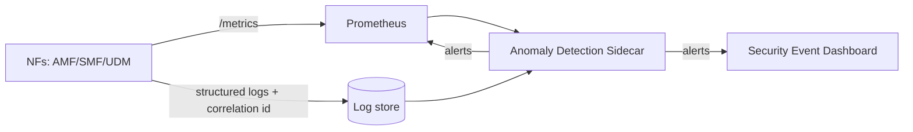

# 15 — Anomaly Detection Engine

> The project's **second differentiating layer**. A lightweight detection **sidecar** runs
> alongside the core, consuming the Prometheus metrics stream (see [11](11-deployment-observability.md))
> and applying statistical and ML-based detection to flag abnormal signalling in real time.



## 1. Threat models addressed

| Threat | Observable signal | Detection method |
|--------|-------------------|------------------|
| Rogue UE / IMSI enumeration | Abnormal registration burst from one location | Rate threshold + **z-score** on registration-count series |
| IMSI catcher (fake gNB) | gNB authenticates, then requests identity **without** AKA | NAS message-sequence anomaly (HMM / rule-based FSM) |
| Session hijacking | SMF receives *modify session* for a session not in its state | State correlation across SMF & UDM logs |
| DoS on AMF | Registration flood from one PLMN/TA | Sliding-window rate limiter + AMF circuit breaker |

## 2. Phased implementation (matches the timeline)

| Phase | Weeks | Approach | Why |
|-------|-------|----------|-----|
| **Phase 1** | 9–10 | Rule-based via Prometheus **alerting rules** | Fast; covers the most common threats |
| **Phase 2** | 11–12 | Statistical: **z-score + IQR** on registration/session count time series | Catches drift the static rules miss |
| **Phase 3** | stretch | **Isolation forest / LSTM** on captured signalling traces | Subtle sequence anomalies; research value |

> **Scope check:** Phases 1–2 are achievable inside the internship and constitute the
> deliverable. Phase 3 is **explicitly a stretch goal** and must not block delivery
> (see risk register in [17](17-deliverables-and-backlog.md)).

## 3. Example — Phase 1 rule (Prometheus)
```yaml
groups:
  - name: 5gc-security
    rules:
      - alert: RegistrationBurst
        expr: increase(amf_registration_requests_total[1m]) > 50
        for: 30s
        labels: { severity: warning, threat: imsi_enumeration }
        annotations:
          summary: "Registration burst — possible IMSI enumeration"
```

## 4. Metrics the engine relies on (export from the NFs)
- `amf_registration_requests_total` (by result, PLMN, TA)
- `smf_pdu_session_total` (by state)
- `sbi_request_duration_seconds` (per service, for latency anomalies)
- `auth_failures_total`

## 5. Validation
Detection is proven, not assumed — see test cases `SEC-03` (IMSI enumeration raises an
alert within 10 registration probes) and the fault-injection scenarios in
[16](16-conformance-test-framework.md). Deliverable **D4** requires validation against at
least three threat scenarios.

## Next
→ [16 — Automated Conformance Test Framework](16-conformance-test-framework.md)
