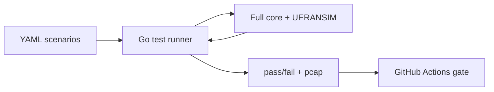

# 16 — Automated Conformance Test Framework

> The project's **third differentiating layer**, and a **first-class deliverable** (D3) — not
> an afterthought. It (1) validates the implementation against 3GPP procedures, (2) enables
> CI/CD regression testing, and (3) demonstrates the security posture under adversarial scenarios.
> It extends, rather than replaces, the testing approach in [10](10-testing-validation.md).

## 1. Test architecture
- **Runner:** Go-based, reusing the core's codebase for protocol familiarity.
- **Scenario format:** **YAML** test cases specifying message sequences, expected responses,
  and timing constraints.
- **Execution:** Docker Compose brings up the full core + RAN simulator; the runner executes
  scenarios and reports pass/fail with **pcap evidence**.
- **CI/CD:** GitHub Actions runs the suite on every commit; **a failing conformance test blocks merge.**



## 2. Conformance test cases

| TC-ID | Test case | Procedure (TS 23.502) | Pass criterion |
|-------|-----------|-----------------------|----------------|
| TC-01 | Initial UE Registration | 4.2.2.2 | UE receives Registration Accept within 2 s |
| TC-02 | 5G-AKA Authentication | 4.6.2 | RAND/AUTN sent, RES* verified, SEAF key derived |
| TC-03 | PDU Session Establishment | 4.3.2 | N1 PDU Session Accept, GTP-U tunnel active |
| TC-04 | UE Deregistration | 4.2.2.3 | All sessions released, AMF state cleared |
| TC-05 | Handover (Xn) *(stretch)* | 4.9.1.2 | UE context transferred, GTP-U path switched |
| SEC-01 | mTLS enforcement — no certificate | TS 33.501 §13 | SBI call rejected with TLS handshake failure |
| SEC-02 | Token scope violation | TS 33.501 §13.3 | AMF→UDM with wrong scope returns HTTP 403 |
| SEC-03 | IMSI enumeration attempt | Threat model | Anomaly engine alerts within 10 registration probes |
| PERF-01 | Registration throughput | KPI baseline | ≥ 50 concurrent registrations without error |
| PERF-02 | PDU session latency | KPI baseline | p95 establishment latency ≤ 500 ms under load |

## 3. Scenario file shape (example)
```yaml
id: TC-01
title: Initial UE Registration
procedure: TS 23.502 §4.2.2.2
timeout: 2s
steps:
  - send: { iface: N1, msg: RegistrationRequest, supi: imsi-001010000000001 }
  - expect: { iface: N1, msg: RegistrationAccept }
pass_when: "registration_accept_received && elapsed < 2s"
evidence: pcap
```

## 4. Fault-injection scenarios
| Scenario | Action | Expected behaviour |
|----------|--------|--------------------|
| NF crash recovery | Kill SMF mid-session | AMF detects NF deregistration via NRF heartbeat timeout; session cleaned up |
| Database unavailability | Disconnect MongoDB | UDM returns **503**, does not hang |
| Certificate expiry | Expire AMF cert | Other NFs reject AMF SBI calls until cert is rotated |
| Network partition | Isolate UPF from SMF via policy | PFCP keepalive triggers session teardown within timeout |

## 5. CI gate (extends [10 §8](10-testing-validation.md))
```yaml
  conformance:
    runs-on: ubuntu-latest
    steps:
      - uses: actions/checkout@v4
      - run: docker compose -f deploy/docker-compose.yml up -d
      - run: go run ./test/runner --suite ./test/scenarios --report junit
      - uses: actions/upload-artifact@v4
        with: { name: pcap-evidence, path: ./test/out/*.pcap }
```

## Next
→ [17 — Deliverables & GitHub Backlog](17-deliverables-and-backlog.md)
