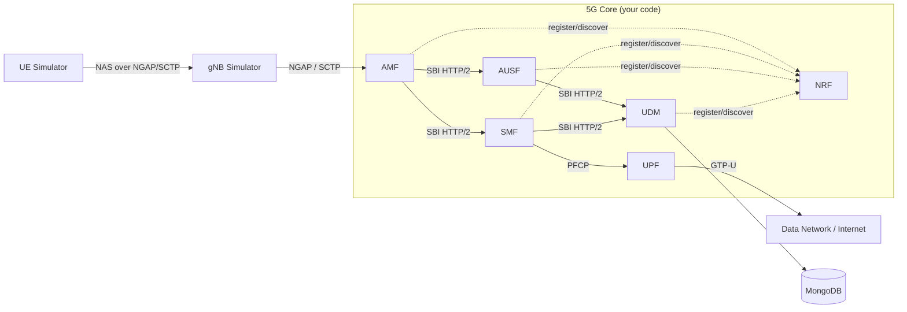

# Cloud-Native 5G Core Prototype — Documentation & Roadmap

This folder is the complete engineering roadmap for building a **cloud-native 5G Core
Network prototype** from the ground up, based on the 3GPP Release 15+ Service-Based
Architecture (SBA). It is written to take you from zero knowledge to a working,
demonstrable Minimal Viable Core (MVP).

> **Goal:** implement the smallest coherent set of network functions that can perform
> the full flow: **UE registration → authentication → PDU session → user-plane data**,
> deployed as containerised micro-services with observability.

---

## How to read this documentation

Read the documents in order. Each builds on the previous one.

| # | Document | What it gives you |
|---|----------|-------------------|
| 00 | [Overview & Vision](00-overview.md) | What we build, scope, MVP definition, success criteria |
| 01 | [5G Architecture Primer](01-5g-architecture-primer.md) | The concepts you must know before coding |
| 02 | [System Architecture](02-system-architecture.md) | Our prototype's components and how they connect |
| 03 | [Technology Stack](03-technology-stack.md) | Languages, libraries, and tools, with rationale |
| 04 | [Environment Setup](04-environment-setup.md) | Build a working Linux dev/lab environment |
| 05 | [Development Roadmap](05-roadmap.md) | Phased plan, milestones, timeline, Gantt |
| 06 | [Network Function Specs](06-network-functions/) | One spec per NF (NRF, AMF, SMF, UPF, AUSF, UDM) |
| 07 | [Call Flows](07-call-flows.md) | The signalling sequences you must implement |
| 08 | [SBI API Design](08-sbi-api-design.md) | REST API contracts between functions |
| 09 | [Data Model](09-data-model.md) | Subscriber, session, and NF-profile schemas |
| 10 | [Testing & Validation](10-testing-validation.md) | How to prove each milestone works |
| 11 | [Deployment & Observability](11-deployment-observability.md) | Docker, Kubernetes, Prometheus, Grafana |
| 12 | [Glossary](12-glossary.md) | Every acronym, defined |
| 13 | [Resources & References](13-resources.md) | 3GPP specs, libraries, learning material |

---

## The MVP at a glance



**Six functions** make up the MVP: **NRF, AMF, SMF, UPF, AUSF, UDM.**
Everything else (PCF, NSSF, NEF, CHF…) is a stretch goal.

---

## Definition of done

The prototype is "done" when, from a UE simulator, you can:

1. Register a subscriber on the core (visible in logs + DB).
2. Pass 5G-AKA authentication.
3. Establish a PDU session and receive an IP address.
4. **Ping the internet through the UPF** over the UE's tunnel interface.
5. See live KPIs (registrations, sessions, throughput) on a Grafana dashboard.

If a packet leaves the UE, traverses your AMF/SMF/UPF, and a reply comes back —
you have built a working 5G Core.

---

## Suggested repository layout for *your* project

```
my5gc/
├── docs/                  ← this folder
├── nrf/                   ← each NF is its own Go module + Dockerfile
├── amf/
├── smf/
├── upf/
├── ausf/
├── udm/
├── common/                ← shared SBI client, models, config, logging
├── deploy/
│   ├── docker-compose.yml
│   ├── kubernetes/
│   └── observability/     ← Prometheus + Grafana configs
├── config/                ← per-NF YAML config
├── scripts/               ← build, run, test helpers
└── Makefile
```

Start at [00-overview.md](00-overview.md).
